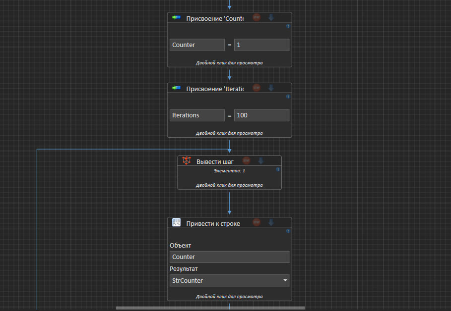
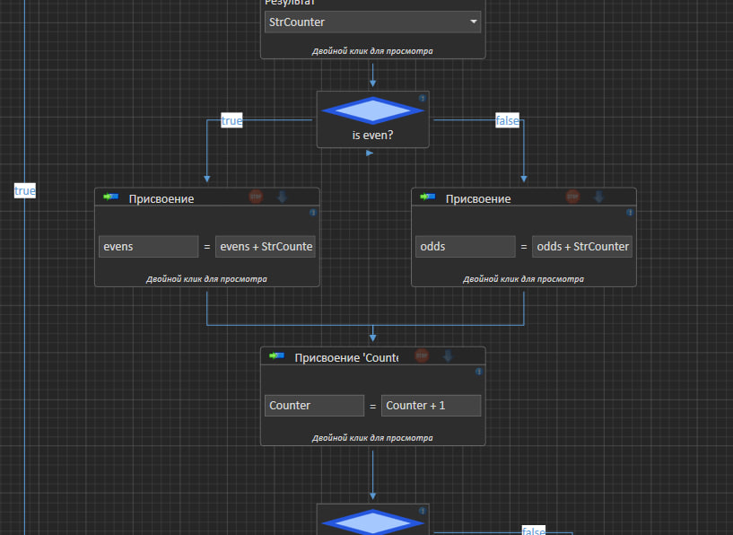
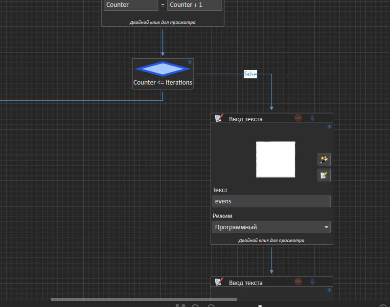
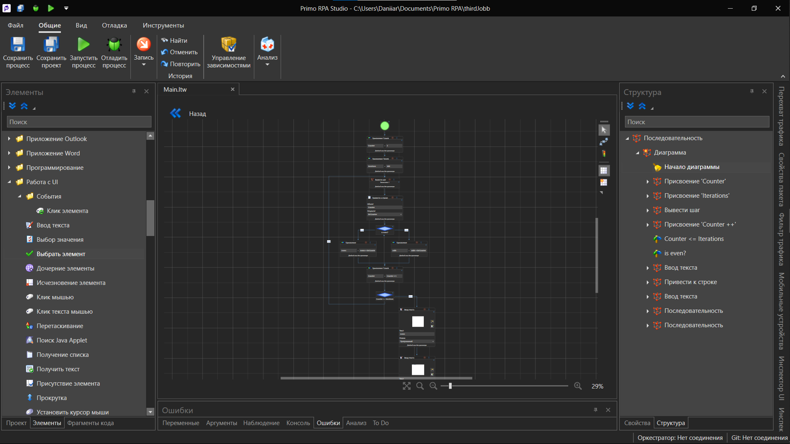
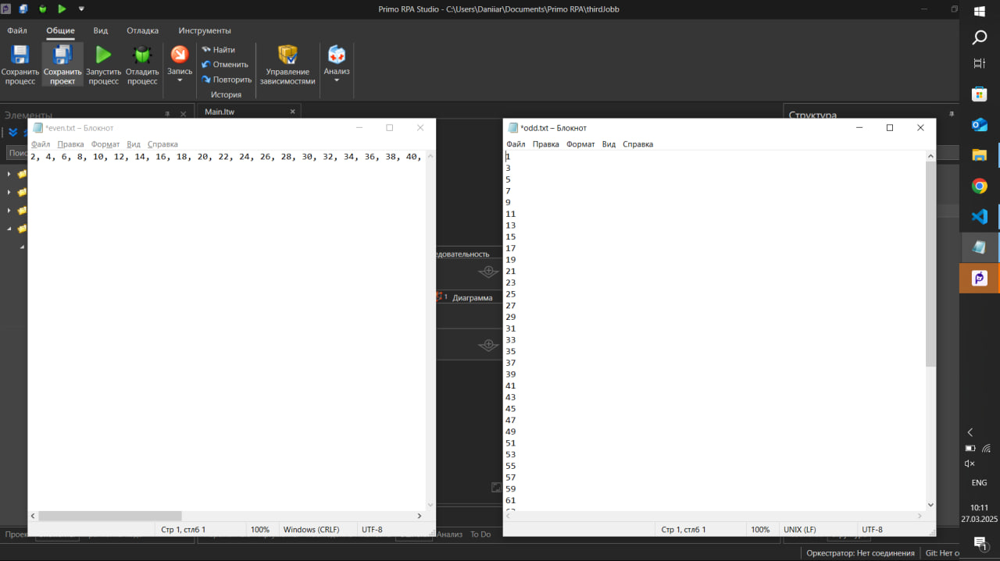

# Тестовое задание от ООО "ЦИТ", выполнил - Латыпов Данияр

## Содержание:
* [ТЗ Задания 1](#задание-1)
* [ТЗ Задания 2](#задание-2)
* [ТЗ Задания 3](#задание-3)
* [Решение задания №1](#решение-задания-1)
* [Решение задания №2](#решение-задания-2)
* [Решение задания №3](#решение-задания-3)

## ТЗ:

### Задание №1

Технологии: python, selenium, excel, chrome, pandas или аналог
Открыть браузер Chrome через selenium. Перейти на сайт: https://www.rpachallenge.com/. Считать файл «challenge.xlsx» с помощью pandas или другого аналога. Полученные данные внести во все формы на сайте https://www.rpachallenge.com/ (их 10 вариантов, появляются после нажатия кнопки «SUBMIT») предварительно нажав кнопку «Start». После выполнения необходимо сделать скриншот результата. Код загрузить в github. 

### Задание №2

Технологии: python, selenium, chrome
Открыть браузер Chrome через selenium. Перейти на сайт: Вы знайте цвета? (arealme.com).  с помощью робота необходимо нажимать на цвет, который отличается от остальных, за 60 секунд необходимо набрать наибольшее количество баллов, наш рекорд: 1669. Код загрузить в github. 

### Задание №3

реда выполнения PrimoRPA
Открыть два экземпляра блокнота. Один называется “odd.txt” другой “even.txt”.
* Организовать цикл от 1 до 100
* Все нечетные числа записать в файл odd.txt через пользовательский интерфейс с переносом строки
* Все четные числа записать в файл even.txt через пользовательский интерфейс с разделителем «,»
* После записи всех чисел в оба файла, их нужно сохранить через пользовательский интерфейс «Файл» -> «Cохранить»
__________________________________________
## Решения

### Решение задания №1:

Кнопка скачивания excel файла ищется при помощи XPATH и затем скачивается при помощи библиотеки requests:
```py
 driver = webdriver.Chrome()
    driver.get("https://www.rpachallenge.com/")

    downloadElement = driver.find_element(By.XPATH, '//*[text()=" Download Excel "]')

    url = downloadElement.get_attribute("href")
  
    response = requests.get(url)
    response.raise_for_status()
```

После получения файла он записывается в файл с расширением xlsx. После чего при помощи pandas считывается содержимое файла. Далее вызывается метод(функция) CreatePersons, которая возвращает словарь словаря, в котором содержатся все данные людей - ключами являются person_(порядковый номер), а их значениями словарь, в котором ключи соответствуют названиям ng-reflect-name полей формы на сайте, значениями являются соответственно искомые данные.  
```py
def CreatePersons(contacts, fields) -> dict:
    rows = contacts.shape[0]
    columns = contacts.shape[1]
    people = dict()
    
    for i in range (rows):
        name = ('person_%s' % i)
        people[name] = { "FirstName" : '', "LastName" : '', "Company" : '', "Role" : '', "Address" : '', "Email" : '',"Phone" : ''}
        for j in range (columns):
            people[name][fields[j]] = str(contacts.iloc[i,j])
    return people
```

Далее вызывается метод FillForm, который уже заполняет поля формы. Искомое поле формы ищется и заполняется во вложенном (внутреннем цикле). Внешний цикл перебирает persons словаря.
```py
def FillForm(persons, fields) -> None:
    for person in persons:
        for i in range(len(fields)):
            element = WebDriverWait(driver, 10).until(EC.presence_of_element_located((By.CSS_SELECTOR, "[ng-reflect-name='label%s']" % fields[i])))
            element.send_keys(persons[person][fields[i]])
        submit_button = driver.find_element(By.XPATH, "//input[@type='submit' and @value='Submit']")
        submit_button.click()
```

Результат работы:


### Решение задания №2:

Для оптимизации и уменьшения ресурсов были настроены некоторые опции Хрома:
``` py
options = webdriver.ChromeOptions()
options.add_argument("--headless")  # Режим без графики
options.add_argument("--disable-extensions")
options.add_argument("--disable-gpu")
options.add_argument("--no-sandbox")
options.add_argument("--disable-dev-shm-usage")
...
options.page_load_strategy = 'eager'
```
Кнопка старта ищется по ID и затем происходит нажатие на этот элемен:
```py
driver = webdriver.Chrome()
driver.get("https://www.arealme.com/colors/ru/")
```

Далее основной цикл реализуется внутури оператора обработки искючений при помощи есконечного цикла While. Для нахождения элементов, чьи цвета необходимо определять, определяем в каком div контейнере они лежат. Ищем div при помощи куска его style, а затем извлекаем из него все блоки span. Чтобы убедиться, что нужный элемент найден используем WebDriverWait. 

Далее создается массив, где первым и третим элементом будут хранится цвета, а вторым и четвертым индексы первого вхождения.

Также заводится счетчик n1, который будет считать сколько вхождений было цвета который хранится в первом индексе массива colors. 

При том цикл перебора квадратов заканчивается когда перебрано минимум 3 элемента и в массиве colors имеются все данные.

Затем при помощи счетчика n1 проверяется является первый цвет в массиве colors уникальным. Номер искомого элемента хранится либо в colors[1], либо в colors[3].
```py
area = WebDriverWait(driver, 10).until(
    EC.visibility_of_all_elements_located(
        (By.CSS_SELECTOR, "div[style*='background-color: rgb(221, 221, 221)'] span")
        )
    )

colors =[]
n1 = 0
for i in range(len(area)):
    color = area[i].value_of_css_property('background-color')
    if len(colors) == 4 and i > 3:
        break
    if color not in colors:
        colors.append(color)
        colors.append(i)
    elif color == colors[0]:
        n1 += 1
if n1 == 0:     
    area[colors[1]].click()
else:
    area[colors[3]].click()
```

Результат работы:


### Решение задания №3:

Все выпонялось в беспатной версии Primo RPA. 

Был создан проект, в который добавлен цикл - постпроверка переменной Counter и прыжком в опредеенный шаг назад. Внутри цикла переменная Counter приводится к строке и записывается в переменную StrCounter. Далее происходит проверка значения Counter на четность или нечетность. После чего происходит ветвление, где в обеих ветках формируется строка evens и строка odds (происходиа конкатенация строк, для перевода переноса строки и каретки использовася символ "\n"), которые после окончания цикла будут записаны в через UI в блокнот. Все этапы представлены на рисунках 1, 2 и 3.

Рисунок 1:


Рисунок 2:


Рисунок 3:


__________________________
Общий вид получившейся поседоватеьности действий:

________________
Результат выпонения алгоритма:


Также представены сами файлы even.txt и odd.txt
